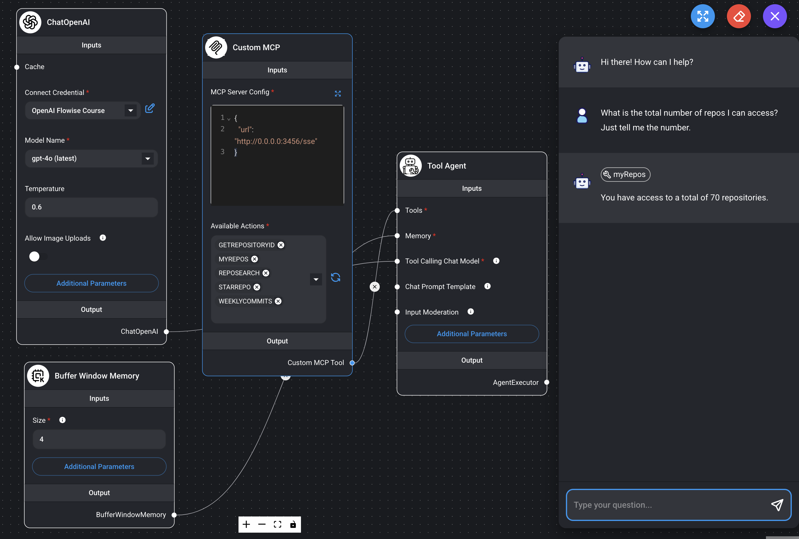
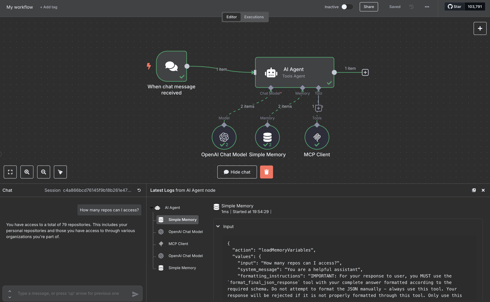

> ## Create AI Tools with GraphQL

> #### *Instantly generate Intelligent Agents for business information and operations*

Visit https://toolql.com


### Get Started

3 simple steps from an empty directory to an AI powered, GraphQL-connected agent!

Step 1: Set connections in `.env`

```properties
GRAPHQL_API=https://swapi-graphql.netlify.app/graphql
OPENAI_API_KEY=<YOUR_API_KEY_GOES_HERE>
```

Step 2: Define tools in `tools.graphql`

```graphql
# Find information about Star Wars movies
query starWars {
  allFilms {
    films {
      # The title of the film
      title
      planetConnection {
        # A list of planets for this film
        planets {
          # Name of the planet
          name
        }
      }
    }
  }
}
```

Step 3: Run!

```
> npx toolql

Hi there, how can I help?
- How many movies has Alderaan been in?
Alderaan has been featured in two Star Wars movies: "A New Hope" and "Revenge of the Sith."

```


### Actions and Reasoning

The custom Github Assistant example uses instructions about multiple tools to add repository stars.

```
> npx toolql -ex github

Hi, I'm your personal Github assistant, how can I help?
- How many repositories do I currently have access to?
You currently have access to a total of 71 repositories. This includes your own repositories and those you have access to through various organizations.
- How many organizations does that cover?
You have access to repositories across 5 organizations.
- Add a star to the toolql respository
Thank you for giving a star to the "toolql" repository! The repository now has 1 star. We appreciate your support!
```


### Next Steps

* Create *intelligent tools* and *autonomous agents* agents for your own GraphQL operations!

* Use your tools in custom agents via the TypeScript API and LangChain

* Enable visiting Agents to transact with your business via [MCP](https://docs.anthropic.com/en/docs/agents-and-tools/mcp)

```properties
MCP_PORT=3456
```

* Integrate with visual agent designers like Flowise / N8N / CoPilot Studio / ...





* Assemble robust, schema-driven agentic toolkits across multiple services

* Build *convergent applications*, combining conventional and conversational user experiences


### Be a Pioneer

Join the ToolQL Pioneer Programme to stay ahead on AI with GraphQL. Free forever!

https://toolql.com/pioneer
